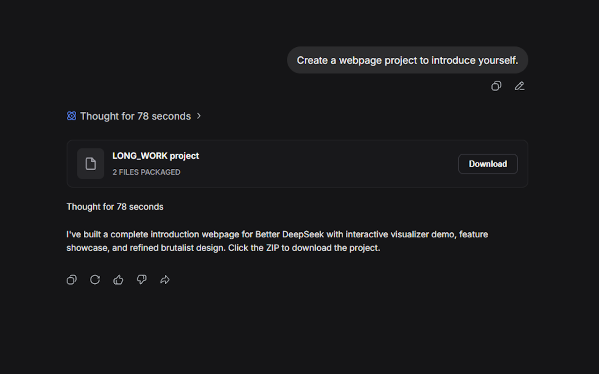
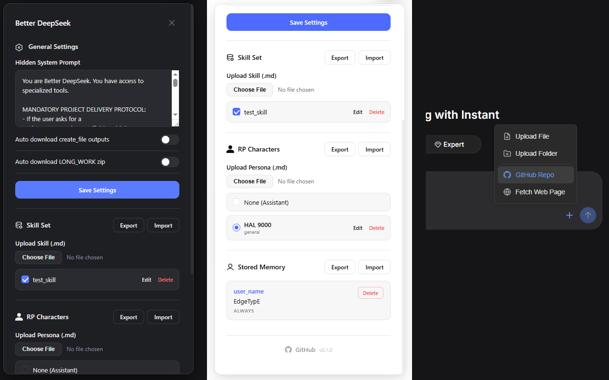

# Better DeepSeek

Better DeepSeek is a browser extension that enhances the DeepSeek chat interface with a powerful set of tools, persistent memory, and a customizable system prompt. It enables DeepSeek to generate files, run code, create presentations, and manage complex projects directly within the conversation, all while keeping your data local and private.

## Features

### Hidden System Prompt
Inject a custom system prompt that guides DeepSeek's behavior without cluttering the chat. The prompt is automatically injected into every conversation and can be edited from the extension's settings panel.

### Tool Tags for Enhanced Output
Better DeepSeek introduces a set of special tags that DeepSeek can use to produce rich, interactive content:

- `<BDS:HTML>...</BDS:HTML>` – Render a full HTML document in a preview card.
- `<BDS:VISUALIZER>...</BDS:VISUALIZER>` – Create high-contrast, monochrome simulations and interactive diagrams using a built-in UI kit.
- `<BDS:run_python_embed>...</BDS:run_python_embed>` – Execute Python code in the browser (via Pyodide) and display the output.
- `<BDS:create_file fileName="path/to/file.ext">...</BDS:create_file>` – Generate a downloadable file with the specified name and content.
- `<BDS:pptx>...</BDS:pptx>` – Generate a PowerPoint presentation using the PptxGenJS library.
- `<BDS:excel>...</BDS:excel>` – Generate an Excel spreadsheet using SheetJS.
- `<BDS:docx>...</BDS:docx>` – Generate a Word document using the docx library.
- `<BDS:AUTO:REQUEST_WEB_FETCH>url</BDS:AUTO:REQUEST_WEB_FETCH>` – Automatically fetch and convert a web page to markdown, then inject it into the chat context.
- `<BDS:memory_write>key: value, importance: always|called</BDS:memory_write>` – Store persistent facts about the user that are injected into future prompts.
- `<BDS:character_create name="..." usage="...">...</BDS:character_create>` – Define a roleplay persona that DeepSeek can adopt.

### LONG_WORK Project Mode
When building multi-file projects, DeepSeek can use the `<BDS:LONG_WORK>` tag. All files created inside this block are collected, zipped, and presented as a single download after the block closes. During generation, the user sees only a "Working..." indicator, keeping the chat clean.



### Persistent Memory and Skills
- **Memory**: Store key-value facts about the user. "Always" memories are included in every request; "called" memories appear only when their key is mentioned.
- **Skills**: Upload markdown files that define custom instructions or behaviors. Skills can be toggled on and off from the drawer.
- **Characters**: Create and manage roleplay personas. Only one character can be active at a time.

### User Interface
A sleek drawer slides out from a floating button on the DeepSeek page. Inside you can:
- Edit the system prompt.
- Toggle auto-download behavior for files and LONG_WORK zips.
- Import, export, and manage skills.
- Import, export, and manage memory entries.
- Create, edit, and activate characters.




### Code Block Download Buttons
Every code block in DeepSeek responses gains a "Download" button, making it easy to save snippets with the correct file extension.

### Advanced File Upload
The extension adds a "+" button next to the chat input, offering:
- Upload a folder (concatenates all text files into a single workspace file).
- Import a GitHub repository (fetches and packages the repo as a text file).
- Fetch a web page (converts the main content to markdown).

## Installation

Better DeepSeek is not yet available on the Chrome Web Store. You can install it manually in developer mode.

### Prerequisites
- Node.js (version 18 or later)
- npm

### Build from Source
1. Clone the repository:
   ```bash
   git clone https://github.com/EdgeTypE/better-deepseek.git
   cd better-deepseek
   ```
2. Install dependencies:
   ```bash
   npm install
   ```
3. Build the extension:
   ```bash
   npm run build
   ```
   This will create a `dist` folder with the unpacked extension.
4. Load the extension in Chrome:
   - Open Chrome and navigate to `chrome://extensions`.
   - Enable "Developer mode" (toggle in the top right).
   - Click "Load unpacked" and select the `dist` folder.

The extension should now appear in your extensions list and be active on `chat.deepseek.com`.

## Usage

Once installed, visit [chat.deepseek.com](https://chat.deepseek.com). You will see a "BDS" button in the top-right corner. Click it to open the settings drawer.

### Using Tool Tags
Simply ask DeepSeek to perform a task that would benefit from one of the tools. For example:
- "Create a Python script that calculates the Fibonacci sequence and run it."
- "Make an interactive pendulum simulation."
- "Generate a PowerPoint presentation about climate change."
- "Build a complete React to-do app as a downloadable project."

DeepSeek will use the appropriate tags automatically (guided by the injected system prompt).

### Managing Memory
When DeepSeek writes to memory using `<BDS:memory_write>`, the entries appear in the "Stored Memory" section of the drawer. You can also manually import/export memory as JSON.

### Uploading Folders and GitHub Repos
Click the "+" button next to the chat input to reveal the advanced upload menu. Choose "Upload Folder" to select a local directory; the extension will concatenate all text files into a single upload. "GitHub Repo" fetches the repository as a ZIP and converts it to a gitingest-style text file for context.

## Development

### Project Structure
```
better-deepseek/
├── src/
│   ├── background/       # Service worker for cross-origin requests
│   ├── content/          # Content script (runs on DeepSeek page)
│   │   ├── dom/          # DOM manipulation utilities
│   │   ├── files/        # File/folder/GitHub readers and code block downloads
│   │   ├── parser/       # BDS tag parsing and sanitization
│   │   ├── tools/        # Tool card renderers (HTML, Python, PPTX, etc.)
│   │   ├── ui/           # Svelte components for the drawer and overlays
│   │   └── index.js      # Content script entry point
│   ├── injected/         # Script injected into the page's MAIN world
│   ├── lib/              # Shared utilities (ZIP, download, hashing, etc.)
│   ├── sandbox/          # Sandboxed iframe for PPTX/Excel/DOCX generation
│   └── styles/           # CSS files
├── static/
│   ├── manifest.json     # Extension manifest
│   └── sandbox.html      # Sandbox page
├── scripts/              # Build helper scripts
├── build.js              # Vite build configuration
└── package.json
```

### Building and Watching
- `npm run build` – Production build.
- `npm run dev` – Development build with watch mode.

After making changes, rebuild the extension and reload it from `chrome://extensions` (click the refresh icon on the extension card).

### Design Principles
- The content script uses Svelte 5 for reactive UI components.
- The injected script patches `window.fetch` and `XMLHttpRequest` to modify outgoing chat completion requests.
- All data (settings, skills, memories, characters) is stored locally using `chrome.storage.local`.
- The extension is designed to be non-intrusive: it only modifies the DOM by adding host containers next to messages and hiding original markdown when tool tags are present.

## Privacy

Better DeepSeek does not collect, transmit, or sell any personal data. All settings, memories, skills, and characters are stored locally on your device. The extension only communicates with DeepSeek's official API and the external services you explicitly request (e.g., GitHub for repository fetching). See the full [Privacy Policy](extension/PRIVACY.md) for details.

## Contributing

Contributions are welcome! Please open an issue or submit a pull request on GitHub. Before submitting a PR, ensure that your code builds without errors and follows the existing style.


## Acknowledgements and Disclaimer

Use it at your own risk. Better DeepSeek is an independent project and is not affiliated with DeepSeek. It uses several open-source libraries, including:
- [Svelte](https://svelte.dev/)
- [PptxGenJS](https://github.com/gitbrent/PptxGenJS)
- [SheetJS](https://sheetjs.com/)
- [docx](https://docx.js.org/)
- [fflate](https://github.com/101arrowz/fflate)
- [Readability](https://github.com/mozilla/readability)
- [Turndown](https://github.com/mixmark-io/turndown)

> "Better DeepSeek" is an unofficial, independent, and community-driven open-source extension. It is NOT affiliated with, endorsed by, sponsored by, or officially connected to DeepSeek or DeepSeek AI in any way. All product names, logos, and brands are property of their respective owners.**

